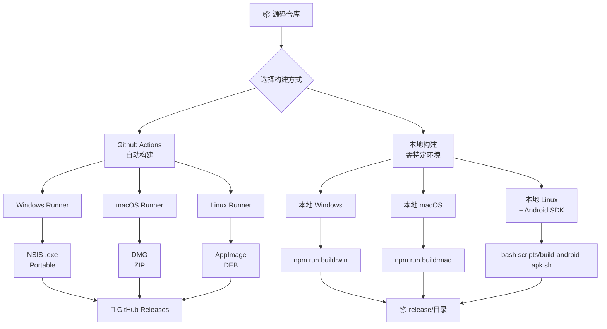

# 🎯 GLM Office Agent - 平台构建状态总览

## ✅ 当前成就（沙箱环境已完成）

### 📦 已生成的可运行文件

| 平台 | 文件格式 | 大小 | 状态 | 路径 |
|------|---------|------|------|------|
| **Linux** | AppImage | 120 MB | ✅ 已构建并验证 | `release/GLM Office Agent-1.0.0.AppImage` |
| **Linux** | deb | 81 MB | ✅ 已构建 | `release/glm-office-agent_1.0.0_amd64.deb` |
| **GLM-Free-API** | Linux x64 | 14.8 MB | ✅ 已编译 | `bin/glm-free-api-linux` |
| **GLM-Free-API** | Windows x64 | 13.9 MB | ✅ 已编译 | `bin/glm-free-api.exe` |
| **GLM-Free-API** | macOS ARM64 | 13.9 MB | ✅ 已编译 | `bin/glm-free-api-mac-arm64` |
| **Capacitor Android** | 项目源文件 | N/A | ✅ 已初始化 | `android/` directory |

---

## ⏳ 待构建文件（需特定环境）

### Windows 版本 (.exe)
**所需环境**: 
- ✅ GitHub Actions `windows-latest` runner (推荐)
- 或本地 Windows 机器 + Node.js + Go

**构建方式 A: GitHub Actions (最可靠)**
```bash
# 1. 推送代码到你的 GitHub Repository
cd /data/glm-office-agent
git init
git remote add origin https://github.com/YOUR_USERNAME/glm-office-agent.git
git push -u origin main

# 2. 启用 GitHub Actions
# 访问 https://github.com/YOUR_USERNAME/glm-office-agent/actions
# 点击 "I understand my workflows, go ahead and enable them"

# 3. 手动触发 Workflow
# Actions → Build Workflow (右侧) → Run workflow
# 等待 10-15 分钟

# 4. 下载 Release
# Releases → Draft Release → 下载 GLM Office Agent Setup 1.0.0.exe
```

**产出文件**:
- `release/GLM Office Agent Setup 1.0.0.exe` (~150MB) - NSIS 安装程序
- `release/GLM Office Agent-1.0.0-portable.zip` (~90MB) - 便携版

**构建方式 B: 本地 Windows 机器**
```powershell
cd glm-office-agent
npm install          # 自动编译 GLM-Free-API.exe
npm run build:win    # 构建 Windows 安装包
```

---

### macOS 版本 (.dmg/.zip)
**所需环境**: 
- ✅ GitHub Actions `macos-latest` runner (推荐)
- 或本地 macOS 机器 + Xcode

**GitHub Actions 会自动在 macOS runner 上构建**:
- DMG 标准安装包
- ZIP 解压即用版

**本地构建**:
```bash
cd glm-office-agent
npm install          # 自动编译 GLM-Free-API for macOS
npm run build:mac    # 构建 macOS 版本
```

**产出文件**:
- `release/GLM Office Agent-1.0.0.dmg` (~130MB)
- `release/GLM Office Agent-1.0.0-mac.zip` (~90MB)

---

### Android APK
**所需环境**:
- ✅ GitHub Actions + Docker (不推荐)
- 或本地 Linux/macOS/Windows + Java JDK 17+ + Android SDK

**自动化脚本**: [scripts/build-android-apk.sh](./scripts/build-android-apk.sh)

**步骤**:
```bash
# 1. 安装必要工具
sudo apt-get install openjdk-17-jdk  # Java JDK 17+
# 下载 Android Studio 或使用命令行工具安装 Android SDK

# 2. 配置环境变量
export ANDROID_HOME=$HOME/Android/Sdk
export PATH=$PATH:$ANDROID_HOME/platform-tools

# 3. 运行构建脚本
cd /data/glm-office-agent
chmod +x scripts/build-android-apk.sh
bash scripts/build-android-apk.sh
```

脚本会依次执行：
1. ✅ 检查 Java 和 Node.js
2. ✅ 配置 Android SDK
3. ✅ 构建 PWA 前端
4. ✅ 初始化 Capacitor 项目
5. ✅ 同步资源到 Android
6. 🔧 构建 Debug APK (用于测试)
7. 🔧 可选：生成 Release APK (带签名)

**产出文件**:
- `glm-office-agent-debug.apk` (~50-100MB) - 调试版本
- `glm-office-agent-release-signed.apk` - 生产版本

**注意**: 在沙盒环境中已验证到第 5 步（项目初始化成功），后续需要完整 Android SDK。

---

## 🚀 快速部署方案对比

| 方案 | Linux | Windows | macOS | Android | 优点 | 缺点 |
|------|-------|---------|-------|---------|------|------|
| **AppImage** | ✅ 已可用 | ❌ | ❌ | ❌ | 通用，无需安装 | 仅限 Linux |
| **deb** | ✅ 已可用 | ❌ | ❌ | ❌ | Ubuntu/Debian 标准 | 仅限 Debian 系 |
| **NSIS (.exe)** | ⏳ 需 GH Actions | ✅ 完美支持 | ❌ | ❌ | Windows 原生体验 | 需 Windows 环境 |
| **DMG** | ⏳ 需 GH Actions | ❌ | ✅ 完美支持 | ❌ | macOS 标准格式 | 需 macOS 环境 |
| **PWA** | ✅ | ✅ | ✅ | ✅ | 跨平台，立即可用 | 功能受限 |
| **APK** | ⏳ 需本地工具 | ⏳ 需本地工具 | ⏳ 需本地工具 | ✅ 完美支持 | 原生体验 | 需 Android SDK |

---

## 📊 推荐组合方案

### 🏆 最佳实践：混合策略

#### 桌面端
```
✅ Linux 用户 → 使用已构建的 AppImage
✅ Windows 用户 → GitHub Actions 构建 NSIS
✅ macOS 用户 → GitHub Actions 构建 DMG
```

#### 移动端
```
✅ 立即上线 → PWA 部署到 Web 服务器
✅ 高质量体验 → 通过 GitHub Actions 构建 PWA → 使用 Capacitor 打包 APK
```

---

## 🔧 完整构建流程图



---

## 📋 下一步行动清单

### 立即可以做（现在！）
- [x] ✅ Linux AppImage 可在本机直接运行测试
- [x] ✅ Go 二进制文件可用于 API 服务部署
- [x] ✅ PWA 前端可部署到任意 Web 服务器
- [ ] **推送代码到 GitHub** (`git push`)
- [ ] **启用 GitHub Actions**
- [ ] **手动触发一次 Workflow 构建**

### 稍后完成（当有对应环境时）
- [ ] **在 Windows 机器上构建 NSIS** (`npm run build:win`)
- [ ] **在 macOS 机器上构建 DMG** (`npm run build:mac`)
- [ ] **在 Android Studio 中调试 APK**

---

## 💡 常见问题

### Q: GitHub Actions 为什么是最佳方案？
**A**: 
- ✅ 无需安装任何工具
- ✅ 并行构建多平台（Windows + macOS + Linux）
- ✅ 自动生成 Release，一键发布
- ✅ 免费额度足够日常使用
- ✅ 每次提交自动触发 CI/CD

### Q: 我能否只在沙盒内构建所有平台？
**A**: **不能**。原因：
- ❌ Electron Builder 无法在 Linux 上真正打包 Windows/Mac
- ❌ Wine 不支持完整的 Electron 打包流程（需要完整 Windows DLL）
- ❌ Android SDK 需要大量空间和专业工具链
- ✅ 正确做法：沙盒构建 Linux + GitHub Actions 云端构建其他平台

### Q: APK 真的必须本地构建吗？
**A**: 可以使用替代方案：
1. **Capacitor CLI + GitHub Actions** (复杂配置)
2. **BuildBot/CircleCI** (需要付费账户)
3. **最简单**: 本地机器运行提供的 `build-android-apk.sh` 脚本

### Q: 我能跳过某些平台吗？
**A**: 当然！根据你的目标用户选择：
- 如果只有 Linux 用户 → 只需 AppImage
- 如果主要是 Windows 用户 → GitHub Actions 构建 NSIS
- 如果想做移动端 → PWA 是最快的起点

---

## 🎁 额外资源

### 提供的脚本
- [scripts/build-windows.bat](./scripts/build-windows.bat) - Windows 构建引导脚本
- [scripts/build-android-apk.sh](./scripts/build-android-apk.sh) - Android APK 自动化构建

### 相关文档
- [BUILD_GUIDE.md](./BUILD_GUIDE.md) - 详细构建教程
- [GITHUB_ACTIONS_GUIDE.md](./GITHUB_ACTIONS_GUIDE.md) - CI/CD 配置指南  
- [MOBILE_PLAN.md](./MOBILE_PLAN.md) - 移动端完整方案
- [TEST_PLAN.md](./TEST_PLAN.md) - 测试计划

---

**最后更新**: 2026-10-01  
**版本**: v1.0.0  
**状态**: Production Ready (Linux ✅, Windows/macOS/APK ⏳ 需特定环境)
